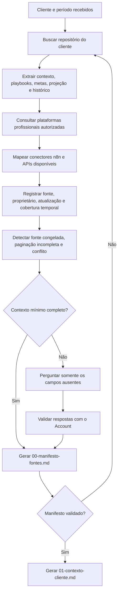
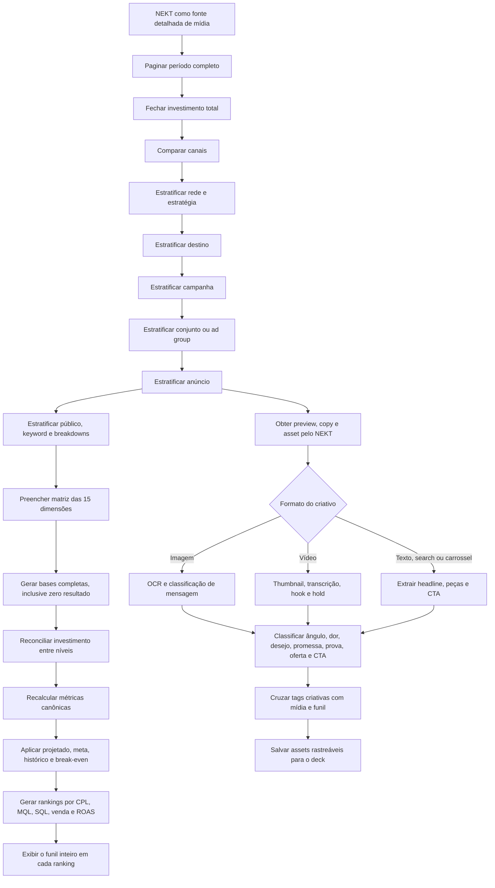
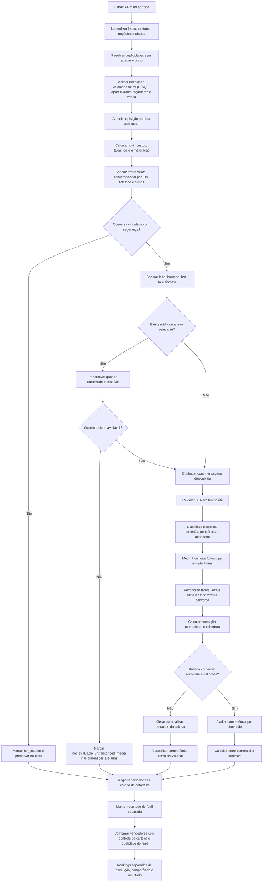
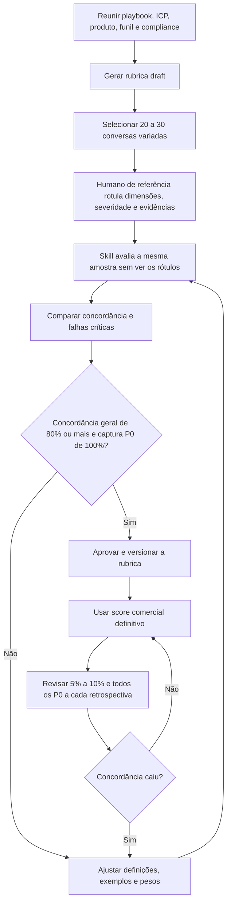
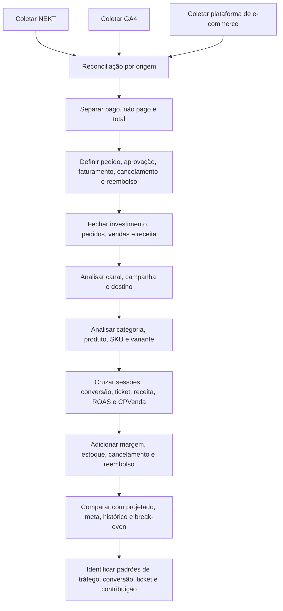
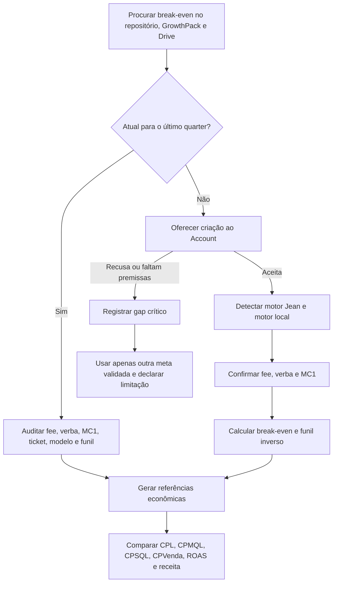
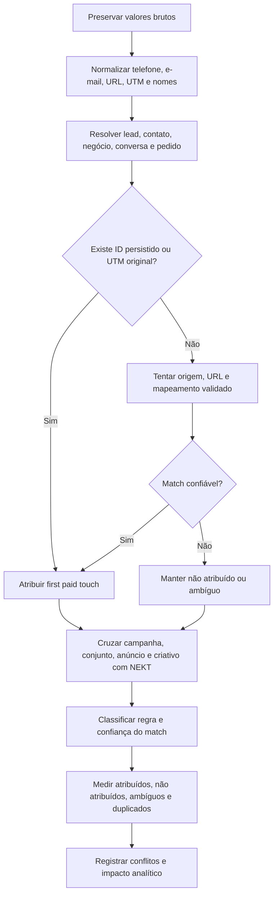
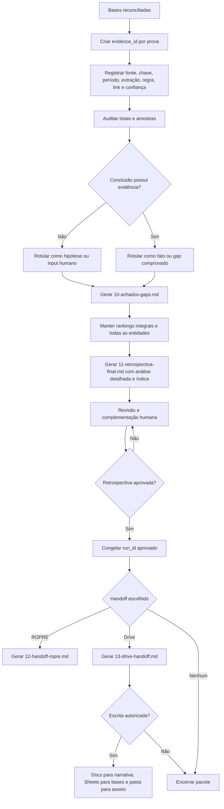

# Workflow detalhado da retrospectiva de performance

Este documento descreve o workflow atual da família `account-retrospectiva-*`. A retrospectiva é independente: produz fatos, rankings, gaps, hipóteses e evidências. Depois da aprovação humana, ela pode alimentar o ROPRE Quarter e o handoff para o Drive.

## 1. Fluxo ponta a ponta

```mermaid
flowchart TD
    A[Solicitação de retrospectiva] --> B{Modo de entrada}
    B -->|Execução independente| C[Definir cliente e período]
    B -->|ROPRE Quarter| D[Adaptador account-ropre-quarter-retrospectiva]
    D --> C

    C --> CA[Descobrir go-live e primeiro evento real]
    CA --> E[Varrer repositório profissional]
    E --> F[Consultar Flow, Cockpit, NEKT, GrowthPack e Drive autorizados]
    F --> G[Descobrir conexões n8n para CRM, GA4, e-commerce e conversas]
    G --> H[Gerar manifesto de fontes e cobertura]
    H --> I{Há lacuna ou conflito material?}
    I -->|Sim| J[Sabatina adaptativa e validação humana]
    I -->|Não| K[Validar modelo de negócio]
    J --> K

    K --> L{Inside sales ou e-commerce?}
    L -->|Inside sales| M[Reconstruir funil lead a lead]
    L -->|E-commerce| N[Reconstruir funil de loja e produtos]

    K --> O[Coletar e analisar mídia]
    O --> P[Analisar e baixar criativos via NEKT]
    M --> Q[Auditar conversas e atendimento]
    Q --> R[Comparar vendedores]

    P --> S[Localizar e auditar break-even]
    R --> S
    N --> S
    S --> T{Break-even válido?}
    T -->|Sim| U[Aplicar metas econômicas aos rankings]
    T -->|Não| V[Oferecer criação pelo motor disponível]
    V -->|Criar| U
    V -->|Recusar ou sem premissas| W[Registrar gap crítico]

    U --> X[Reconciliar mídia, CRM, conversas, GA4 e loja]
    W --> X
    X --> Y[Montar ledger de evidências]
    Y --> Z[Consolidar vencedores, perdedores, padrões e gaps]
    Z --> ZA[Preservar módulos, tabelas integrais, bases e evidências]
    ZA --> AA[Gerar retrospectiva final detalhada + índice completo]
    AA --> AB[Complementação humana]
    AB --> AC{Comando retrospectiva aprovada?}
    AC -->|Não| AB
    AC -->|Sim| AD{Próxima saída desejada}
    AD -->|Iniciar planejamento| AE[Gerar handoff e chamar ROPRE Quarter]
    AD -->|Preparar publicação| AF[Gerar manifesto de Drive]
    AD -->|Encerrar| AG[Manter pacote versionado]
    AF --> AH{Autorização explícita para escrever?}
    AH -->|Sim| AI[Publicar Docs, Sheets e assets em nova versão]
    AH -->|Não| AG
```



## 2. Descoberta de contexto e fontes



### Contexto mínimo

- cliente, projeto, período e comparações desejadas;
- quarter calendário, go-live técnico, primeiro evento real, `analysis_start` e eventuais relançamentos;
- inside sales ou e-commerce;
- oferta, público, região, canais e destinos;
- CRM ou plataforma de loja, GA4 e ferramenta conversacional;
- vendedores e papéis;
- MQL, SQL, oportunidade, orçamento e venda;
- horário comercial, fuso, finais de semana, feriados e exceções;
- verba, fee, margem, ticket, metas, projeção e break-even;
- calendário, sazonais, onboardings, roadmap e funcionalidades do próximo ciclo.

## 3. Mídia e criativos



### Hierarquia analítica

```text
Geral
└── Canal
    └── Rede ou estratégia
        └── Destino
            └── Campanha
                └── Conjunto ou ad group
                    └── Anúncio ou criativo
                        └── Público, keyword e breakdowns
```

Os destinos ficam comparáveis dentro de contexto compatível: site, landing page, formulário nativo, WhatsApp e outros. Os rankings não escolhem um único “campeão universal”; cada lente ordena por uma métrica e preserva o restante do funil.

O resumo só é escrito depois das bases. Se campanha, conjunto, anúncio, público ou breakdown estiver ausente, a matriz identifica a lacuna, a skill solicita fonte/API/export/input manual e o módulo permanece `partial`.

## 4. Inside sales: funil, atendimento e vendedores



### As três camadas de julgamento

| Camada | Responde a quê? | Exemplos | Pode virar ranking? |
|---|---|---|---|
| Execução operacional | O processo foi executado? | SLA útil, resposta, conexão, pendência, follow-up, tarefa e etapa | Sim, com cobertura explícita |
| Competência comercial | A conversa foi bem conduzida para este projeto? | descoberta, qualificação, valor, objeções, próximo passo, tom | Sim, somente com rubrica calibrada |
| Resultado de funil | O que aconteceu depois? | MQL, SQL, oportunidade, orçamento, venda, receita e ciclo | Sim, separado das duas notas |

Não existe score total combinando as três camadas.

### Calibração da competência comercial



## 5. E-commerce



## 6. Break-even e julgamento de performance



O julgamento de “bom” ou “ruim” considera meta, verba, histórico, custo esperado, maturação e break-even do próprio cliente. Não existe volume mínimo global que funcione para todos.

## 7. Reconciliação e atribuição



Telefone e e-mail ajudam a identificar a pessoa. Eles não provam sozinhos qual campanha adquiriu o lead; a campanha exige ID, UTM, URL, origem ou mapeamento previamente validado.

## 8. Evidência, consolidação e publicação



## 9. Arquivos produzidos

| Ordem | Arquivo | Módulo responsável | Quando aparece |
|---:|---|---|---|
| 00 | `00-manifesto-fontes.md` | contexto e fontes | Sempre |
| 01 | `01-contexto-cliente.md` | contexto e fontes | Sempre |
| 02 | `02-midia.md` | mídia | Quando houver mídia |
| 03 | `03-criativos.md` | criativos | Quando houver criativos |
| 04 | `04-funil-inside-sales.md` | funil inside sales | Inside sales |
| 04 | `04-ecommerce.md` | e-commerce | E-commerce |
| 05 | `05-vendedores.md` | vendedores | Inside sales |
| 06 | `06-atendimento.md` | atendimento | Quando houver dados conversacionais |
| 07 | `07-breakeven.md` | break-even | Sempre, mesmo que registre gap |
| 08 | `08-reconciliacao.md` | reconciliação | Sempre |
| 09 | `09-evidencias.md` | evidências | Sempre |
| 10 | `10-achados-gaps.md` | achados e gaps | Sempre |
| 11 | `11-retrospectiva-final.md` | consolidação | Sempre |
| 12 | `12-handoff-ropre.md` | adaptador ROPRE | Somente se o usuário iniciar o planejamento |
| 13 | `13-drive-handoff.md` | handoff Drive | Somente se solicitado após aprovação |

Bases aplicáveis:

- `bases/cobertura-midia.md`;
- `bases/canais.md`;
- `bases/destinos.md`;
- `bases/campanhas.md`;
- `bases/conjuntos.md`;
- `bases/anuncios.md`;
- `bases/breakdowns.md`;
- `bases/leads-negocios.md`;
- `bases/conversas.md`;
- `bases/produtos.md`;
- `bases/pedidos.md`;
- `assets/criativos/`.

## 10. Gates e responsabilidades humanas

| Gate | Por que existe | Quem valida |
|---|---|---|
| Manifesto de fontes | Evita analisar fonte errada, congelada ou incompleta | Account ou responsável pelos dados |
| Modelo e definições de funil | MQL, SQL e venda variam por cliente | Account e liderança comercial |
| Fonte oficial em conflito | Impede soma ou escolha arbitrária | Dono do dado |
| Fee, verba e MC1 | Sustentam o break-even | Account ou responsável financeiro |
| Rubrica comercial | Torna o julgamento aderente ao projeto | Liderança comercial ou Account |
| Calibração da rubrica | Impede score subjetivo não validado | Humano de referência |
| Retrospectiva aprovada | Congela o pacote antes de planejar ou publicar | Usuário responsável |
| Escrita no Drive | É uma ação externa e versionada | Usuário responsável |
| Início do ROPRE | Separa retrospectiva de planejamento | Usuário responsável |

## 11. Limites do workflow

- A retrospectiva não cria tarefas, não muda etapas, não envia alertas e não escreve no CRM.
- A retrospectiva não define prioridade, responsável ou prazo; entrega os insumos para o ROPRE.
- Credenciais ficam em conectores ou variáveis seguras, nunca em Markdown ou dentro da skill.
- Ausência de fonte vira lacuna explícita; não vira zero nem conclusão inventada.
- Correlação entre atendimento, mídia e venda não vira causalidade sem prova.
- Toda execução é versionada em `checkins/quarter/{ano}/Q{n}/retrospectiva-performance/{run_id}/` e nunca sobrescreve o histórico.
