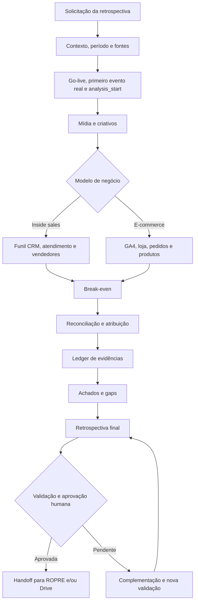

# Retrospectiva Quarter

Família de skills para produzir retrospectivas trimestrais de performance auditáveis, orientadas a dados e prontas para alimentar o planejamento do ROPRE Quarter.

O fluxo reconstrói o que aconteceu no período, compara projetado e realizado, identifica vencedores, perdedores e gaps e preserva a evidência de cada conclusão. A retrospectiva não cria plano de ação: priorização, responsáveis, prazos e backlog pertencem ao ROPRE.

## Visão geral



## Skill principal

`account-retrospectiva-performance-maestro` orquestra a execução completa. Ela aceita dois modelos de negócio:

- `inside_sales`: mídia, CRM, funil, atendimento, conversas e vendedores;
- `ecommerce`: mídia, GA4, plataforma de loja, pedidos, produtos e receita.

A skill pode ser chamada diretamente ou pelo adaptador `account-ropre-quarter-retrospectiva` durante um ROPRE Quarter.

## Módulos

| Ordem | Skill | Responsabilidade |
|---:|---|---|
| 1 | `account-retrospectiva-contexto-fontes` | Descobrir contexto, fontes, período e janela válida de performance |
| 2 | `account-retrospectiva-midia` | Analisar mídia do geral ao anúncio e aos breakdowns |
| 3 | `account-retrospectiva-criativos` | Auditar assets, mensagens, formatos, hooks e CTAs |
| 4A | `account-retrospectiva-funil-inside-sales` | Reconstruir o funil lead a lead |
| 4B | `account-retrospectiva-ecommerce` | Reconstruir loja, pedidos, receita e produtos |
| 5 | `account-retrospectiva-atendimento` | Auditar SLA útil, resposta, cadência e qualidade comercial |
| 6 | `account-retrospectiva-vendedores` | Comparar execução, competência e resultado por vendedor |
| 7 | `account-retrospectiva-breakeven` | Localizar, auditar ou criar referências econômicas |
| 8 | `account-retrospectiva-reconciliacao` | Resolver identidade, atribuição e conflitos entre fontes |
| 9 | `account-retrospectiva-evidencias` | Construir o ledger probatório |
| 10 | `account-retrospectiva-achados-gaps` | Consolidar fatos, hipóteses, vencedores, perdedores e gaps |
| 11 | `account-retrospectiva-consolidacao` | Gerar a retrospectiva final e validar completude |
| 12 | `account-retrospectiva-drive-handoff` | Preparar a publicação versionada no Drive |

## Princípios do fluxo

- O quarter calendário e a janela de performance são tratados separadamente.
- O julgamento de performance começa em `analysis_start`, após o go-live com tracking funcional.
- Ausência de dado é `sem dado`, nunca zero.
- Atribuição oficial de aquisição usa `first_paid_touch`.
- Toda conclusão aponta para um ou mais `evidence_id`.
- Rankings preservam o funil completo e todas as entidades, inclusive zero resultado.
- Correlação não é apresentada como causalidade.
- Execução operacional, competência comercial e resultado de funil são julgamentos separados.
- Nenhuma execução anterior é sobrescrita.

## Fontes

O fluxo procura primeiro as fontes profissionais autorizadas:

- Flow e Cockpit para contexto, escopo e contrato;
- GrowthPack ou forecast aprovado para projetado versus realizado;
- NEKT para mídia, previews e assets de criativos;
- CRM para MQL, SQL, oportunidades, propostas e vendas;
- GA4 para sessões e eventos web;
- plataforma de e-commerce para pedidos, cancelamentos e reembolsos;
- ferramenta conversacional para mensagens e atendimento;
- Drive para documentos oficiais, projeções, backups e histórico.

Conflitos materiais entre fontes são apresentados ao responsável pelo dado. A skill não escolhe silenciosamente uma versão.

## Estrutura de uma execução

Cada execução é gravada em:

```text
checkins/quarter/{ano}/Q{n}/retrospectiva-performance/{run_id}/
```

Arquivos canônicos:

```text
00-manifesto-fontes.md
01-contexto-cliente.md
02-midia.md
03-criativos.md
04-funil-inside-sales.md | 04-ecommerce.md
05-vendedores.md
06-atendimento.md
07-breakeven.md
08-reconciliacao.md
09-evidencias.md
10-achados-gaps.md
11-retrospectiva-final.md
12-handoff-ropre.md
13-drive-handoff.md
bases/
assets/criativos/
```

## Gates obrigatórios

O workflow exige validação humana para:

1. manifesto de fontes;
2. modelo de negócio e definições do funil;
3. fonte oficial quando houver conflito material;
4. fee, verba e MC1 usados no break-even;
5. rubrica e calibração da competência comercial;
6. comando explícito `retrospectiva aprovada`;
7. autorização de escrita no Drive;
8. início do planejamento ROPRE.

Antes da aprovação, execute:

```bash
python .agents/skills/account-retrospectiva-performance-maestro/scripts/validate_retrospectiva.py <run_dir> --approval-ready
```

Se o gate falhar, o pacote permanece `partial` ou `blocked` e informa exatamente as fontes, dimensões, entidades ou métricas ausentes.

## Validação da família

As skills são mantidas em duplo-write nas árvores `.agents/skills` e `.claude/skills`.

```bash
python .agents/skills/account-retrospectiva-performance-maestro/scripts/validate_family.py .
python .agents/skills/account-retrospectiva-performance-maestro/tests/test_contracts.py
python .agents/skills/account-retrospectiva-atendimento/tests/test_business_time.py
```

## Integração com o ROPRE Quarter

Depois de `retrospectiva aprovada`, o adaptador gera `12-handoff-ropre.md` e entrega ao ROPRE:

- projetado versus realizado;
- vencedores e perdedores por lente;
- gaps comprovados e hipóteses;
- metas e limites do break-even;
- lacunas, conflitos e cobertura;
- índice de evidências e assets.

O ROPRE transforma esses insumos em objetivos, priorização, plano 5W1H, responsáveis, prazos, projeção e backlog.

## Limites

A retrospectiva não cria tarefas, não muda etapas, não envia alertas e não escreve no CRM. Credenciais permanecem em conectores ou variáveis seguras e nunca são registradas nos arquivos da skill.
